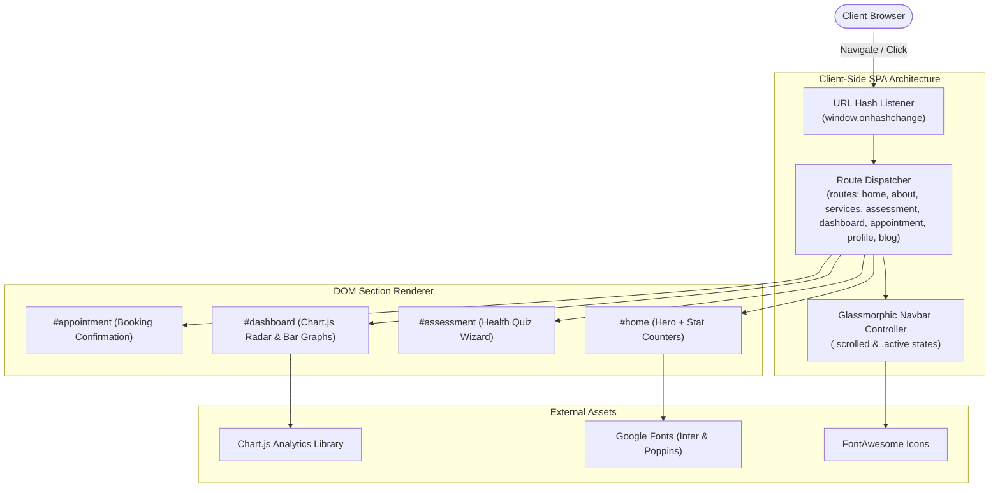

<div align="center">

<!-- Animated Header Wave Banner -->


<!-- Animated Typing Subtitle -->


<br>

<p align="center">
  <a href="https://design-thinking-project-kappa.vercel.app" target="_blank">
    
  </a>
  
  
  
  
</p>

<!-- Live Operational Indicators -->
<p align="center">
  
  
  
  
</p>

<p align="center">
  <b>A human-centered health-tech Single Page Application (SPA) integrating non-invasive bio-energy diagnostics, Ayurvedic principles, and modern data visualization to provide holistic wellness assessments.</b>
</p>

</div>

---

### 🌐 Live Application Demo

🔗 **Explore the Live App on Vercel:** **[https://design-thinking-project-kappa.vercel.app](https://design-thinking-project-kappa.vercel.app)**

---

### ⚡ Interactive Diagnostic & Wellness Assessment Simulation

<div align="center">

<!-- Animated Interactive Assessment Terminal -->


</div>

---

## 📑 Table of Contents

- [Overview](#-overview)
- [Design Thinking Framework](#-design-thinking-framework)
- [System Architecture & Router](#-system-architecture--router)
- [Key Features](#-key-features)
- [Interactive Analytics & Visualizations](#-interactive-analytics--visualizations)
- [Project Structure](#-project-structure)
- [Getting Started](#-getting-started)
- [Author & Connect](#-author--connect)

---

## 💡 Overview

Modern healthcare frequently isolates physical symptoms without addressing mental vitality, stress levels, or systemic balance. Patients often find diagnostic clinics intimidating, sterile, and reactive rather than preventative.

**Quantum Wellness** is a design-thinking driven wellness platform created to transform holistic health discovery:
- **Non-Invasive Diagnostic Philosophy:** Combines energy diagnostics, acupressure, and Ayurvedic body-typing (Doshas) with modern analytical assessments.
- **Glassmorphic Aesthetic:** Employs calming, nature-inspired emerald and cyan translucent glassmorphic components to reduce patient anxiety.
- **Instant Interactive Visualization:** Uses **Chart.js** to transform subjective health answers into clear, actionable radar and bar charts.
- **Frictionless Single Page Experience:** Pure JavaScript hash-based routing ensures zero-page-reload transitions between assessment, booking, and health dashboards.

---

## 🎨 Design Thinking Framework

This project was built following the formal **5-Stage Design Thinking Methodology**:

```
[1. Empathize] ──► [2. Define] ──► [3. Ideate] ──► [4. Prototype] ──► [5. Test & Deploy]
```

1. **Empathize:** Conducted user interviews with health-conscious individuals who felt overwhelmed by complex medical jargon and sought natural, non-invasive wellness guidance.
2. **Define:** Formulated the core problem statement: *“How might we provide individuals with an accessible, calming, and visually intuitive platform to understand their holistic health metrics without invasive procedures?”*
3. **Ideate:** Brainstormed combining ancient Ayurvedic energy frameworks with modern biometric visualizations and self-guided health questionnaires.
4. **Prototype:** Built an interactive, high-fidelity responsive Single Page Application with dynamic Chart.js diagnostics and appointment booking wizards.
5. **Test & Deploy:** Validated layout readability, mobile touch interactions, and deployed globally to **Vercel** with instant worldwide availability.

---

## 🏛 System Architecture & Router

The application operates as a pure client-side Single Page Application (SPA) driven by an active hash change listener:



---

## ✨ Key Features

| Feature | Details |
| :--- | :--- |
| 🌿 **Holistic Wellness Assessment** | Interactive health quiz categorizing user lifestyle, stress indices, and Ayurvedic energy balance. |
| 📊 **Dynamic Chart.js Dashboards** | Interactive health radar and trend charts visualizing sleep quality, vitality scores, and balance metrics. |
| ⚡ **Hash-Based SPA Routing** | Instant navigation without server round-trips across 8 distinct sections (`home`, `about`, `services`, `assessment`, `dashboard`, `appointment`, `profile`, `blog`). |
| 🔮 **Glassmorphic Modern UI** | Translucent frosted-glass cards, smooth blur effects, subtle drop shadows, and responsive layout grids. |
| 📅 **Appointment Scheduling** | Integrated appointment booking interface enabling users to schedule in-person wellness consultations. |
| 📱 **Mobile-First Responsive** | Optimized for seamless viewing on smartphones, tablets, and wide-screen desktops. |
| 🚀 **Vercel Edge Deployment** | Globally cached on Vercel's Edge Network for instant sub-second load times. |

---

## 📊 Interactive Analytics & Visualizations

The platform features built-in **Chart.js** diagnostic integrations inside the user dashboard:

- **Vitality Radar Chart:** Plots 6 dimensions of health (Energy, Sleep, Digestion, Immunity, Mental Calm, and Physical Balance).
- **Stress & Recovery Trends:** Multi-axis line chart tracking daily recovery rhythms.
- **Live Counter Animations:** Counters smoothly animate upward when scrolling into the statistics view.

---

## 📂 Project Structure

```
design-thinking-project/
├── index.html          # Core SPA markup containing all 8 page sections
├── style.css           # Glassmorphism, animations, responsive design tokens
├── app.js              # Routing engine, Chart.js initializer, scroll effects
└── README.md           # Project documentation
```

---

## 🚀 Getting Started

### 1. View Online
Simply visit the production deployment:  
👉 **[https://design-thinking-project-kappa.vercel.app](https://design-thinking-project-kappa.vercel.app)**

### 2. Run Locally

No build tools or compilers required!

```bash
# Clone the repository
git clone https://github.com/anish03-hub/design-thinking-project.git
cd design-thinking-project

# Option A: Open directly in your browser
open index.html

# Option B: Run with a local development server
npx serve .
```

---

<div align="center">

## 👨‍💻 Author & Connect

**Anish Kumar Sah**  
*Java Developer | Spring Boot & REST APIs | B.Tech CSE @ Symbiosis Institute of Technology, Pune*

[](https://www.linkedin.com/in/anishsah)
[](mailto:sah42515@gmail.com)
[](https://github.com/anish03-hub)

<br>

<!-- Animated Waving Footer Banner -->


<sub>Built with ❤️ using HTML5, CSS3 Glassmorphism, JavaScript, and Chart.js. Applying Design Thinking to healthcare technology.</sub>

</div>
